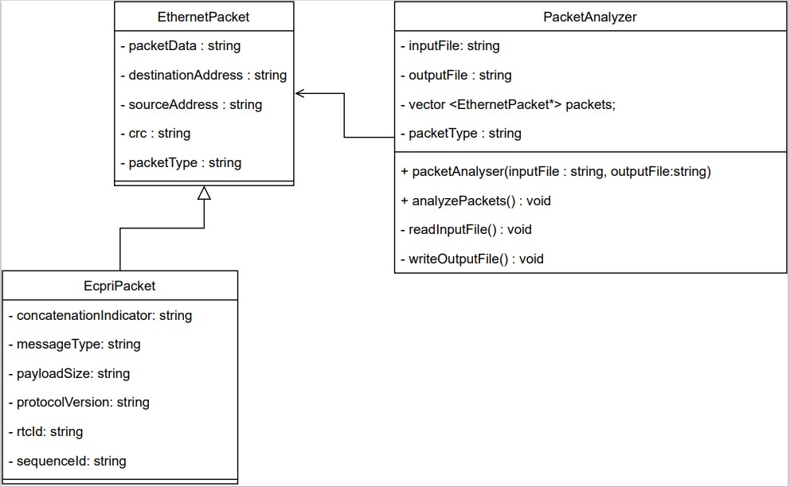

# Packet Analyzer

## Overview

The Packet Analyzer is a software tool designed to read input text files containing Ethernet packets, parse each packet into its individual fields, and save the parsed packets along with their fields to an output text file. This README provides an overview of the project, the input and output formats, instructions on how to run the program and a UML diagram depicting the project's design.

## Input Format

- The input text file should contain Ethernet packets, with one packet per line.
- Each line represents the data of a single packet.
- Ethernet packets can either be raw Ethernet frames or Enhanced Common Public Radio Interface (e-CPRI) frames built over Ethernet.
- To identify an e-CPRI frame, the program checks that the Type field is "AEFE."

Sample Input:

   `FB555555555555D50000000000C1ECCD655507D9AEFE1002001480680180900000400101D10000100000FFFE7E040000000000000000000000000000000000000000000099AC762B`
   `FB555555555555D5011B19000000ECCD655507D988F70B120040EE007F630000000005397FB111221122ABBADEADBEEFCAFEFEED0001057F0000633090181625A4E8FDEC00FECDDCEFFEFF4444444455555555CAFECC000F70B3`

## Output Format

- The program writes the parsed packets to an output text file.
- Each line in the output file represents a parsed packet with its fields.

Sample Output:
   ```plaintext
   Packet # 1:
   FB555555555555D50000000000C1ECCD655507D9AEFE1002001480680180900000400101D10000100000FFFE7E040000000000000000000000000000000000000000000099AC762B
   CRC: 99AC762B
   Concatenation Indicator: 0
   Destination Address: 0000000000C1
   Message Type: 02
   Payload Size: 0014
   Protocol Version: 1
   RTC ID: 8068
   Sequence ID: 0180
   Source Address: ECCD655507D9
   Type: AEFE
   **************************************************************************************************************************************************************************************************************************************
   Packet # 2:
   FB555555555555D5011B19000000ECCD655507D988F70B120040EE007F630000000005397FB111221122ABBADEADBEEFCAFEFEED0001057F0000633090181625A4E8FDEC00FECDDCEFFEFF4444444455555555CAFECC000F70B3
   CRC: 000F70B3
   Destination Address: 011B19000000
   Source Address: ECCD655507D9
   Type: 88F7
   ```
## Running the Program

1. Clone or download the project repository.
2. Open the project in your preferred C++ development environment (e.g., Visual Studio Code).
   3. Ensure that you have the following header files included:

      ```cpp
      #include <iostream>
      #include "EthernetPacket.h"
      #include "EcpriPacket.h"
      #include "PacketAnalyzer.h"
   
      4. In the main() function of the main program file (e.g., main.cpp), create a PacketAnalyzer instance, specifying the input and output file names:
   
         ```cpp
         int main() {
             PacketAnalyzer packetAnalyzer("../input_packets.txt", "../output_packets.txt");
             packetAnalyzer.readFromInputFile();
             packetAnalyzer.writeToOutputFile();
             return 0;
          }

5. Make sure that the input file is placed in the same folder with the (main.cpp) file. 
6. Build and run the program using your C++ development environment.
7. The parsed packets will be saved to the specified output file.
   
##  UML Diagram

